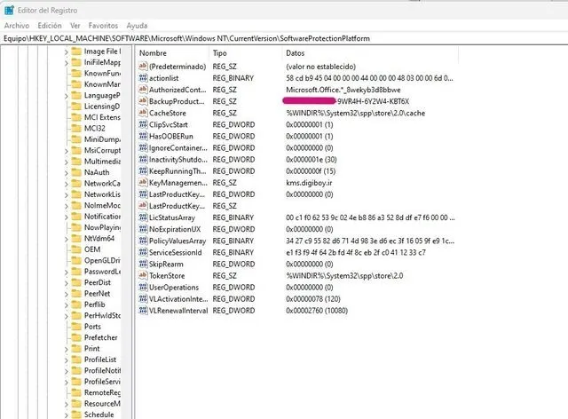

## **Introducción**  
¿Perdiste la clave de licencia de un programa importante? **Show Key Plus** es una herramienta gratuita y portable que recupera claves de producto de software instalado en Windows. Además, te enseñaremos **cómo encontrar manualmente las claves en el Registro de Windows (regedit)** como alternativa.  

---  

## **¿Qué es Show Key Plus?**  
**Show Key Plus** es una utilidad ligera que escanea tu sistema en busca de claves como:  
✔ **Windows** (7, 8, 10, 11)  

Es útil para:  
🔹 Recuperar claves antes de formatear.  
🔹 Hacer copias de seguridad de licencias.  
🔹 Verificar autenticidad de software.  

---  

## **Cómo Descargar y Usar Show Key Plus**  
1. **Descarga**:  
   - Obtén Show Key Plus [desde este enlace](https://drive.google.com/file/d/14sK7iqUz0yCHnx8NUuYs4VKXuDaIVjJ_/view?usp=sharing).  
   - No requiere instalación, solo ejecuta el archivo `.exe`.  

2. **Escaneo automático**:  
   - Al abrirlo, muestra todas las claves detectadas.  
   - Puedes **exportarlas en .TXT o .CSV** para respaldo.  

---  

## **Cómo Buscar Claves Manualmente en Regedit**  
Si Show Key Plus no detecta una clave, puedes buscarla en el **Editor del Registro (regedit)**:  



### **1. Clave de Windows**  
- Abre **regedit** (presiona `Win + R`, escribe `regedit` y pulsa Enter).  
- Navega a:  
  ```
  HKEY_LOCAL_MACHINE\SOFTWARE\Microsoft\Windows NT\CurrentVersion
  ```  
- Busca los valores:  
  - **DigitalProductId** (clave encriptada).  
  - **ProductId** (número de identificación).  

### **2. Clave de Microsoft Office**  
- Ve a:  
  ```
  HKEY_LOCAL_MACHINE\SOFTWARE\Microsoft\Office\[versión]\Registration
  ```  
  (Ejemplo: `...\Office\16.0\Registration` para Office 2016/365).  
- Busca una carpeta con un **GUID** (código largo) y revisa el valor **DigitalProductID**.  

### **3. Claves de Otros Programas**  
- Muchos programas guardan sus claves en:  
  ```
  HKEY_LOCAL_MACHINE\SOFTWARE\[Nombre del Desarrollador]\[Nombre del Programa]
  ```  
- Busca valores como **SerialKey**, **LicenseKey** o **ProductKey**.  

⚠ **Precaución**: No modifiques nada en regedit si no estás seguro.  

---  

## **Ventajas de Show Key Plus vs. Regedit**  
| **Show Key Plus** | **Regedit** |  
|------------------|------------|  
| Escaneo automático | Búsqueda manual |  
| Interfaz amigable | Requiere conocimientos técnicos |  
| Exporta claves fácil | No permite exportación directa |  
| Detecta múltiples programas | Depende de la ruta del registro |  

---  

## **Conclusión**  
**Show Key Plus** es la forma más sencilla de recuperar claves, pero si necesitas una alternativa, **regedit** te permite encontrarlas manualmente.  

📌 **¿Problemas con una licencia?** Prueba Show Key Plus primero y, si no aparece, revisa el registro.  

¿Tienes preguntas? ¡No dudes en contactarme por telegram!  