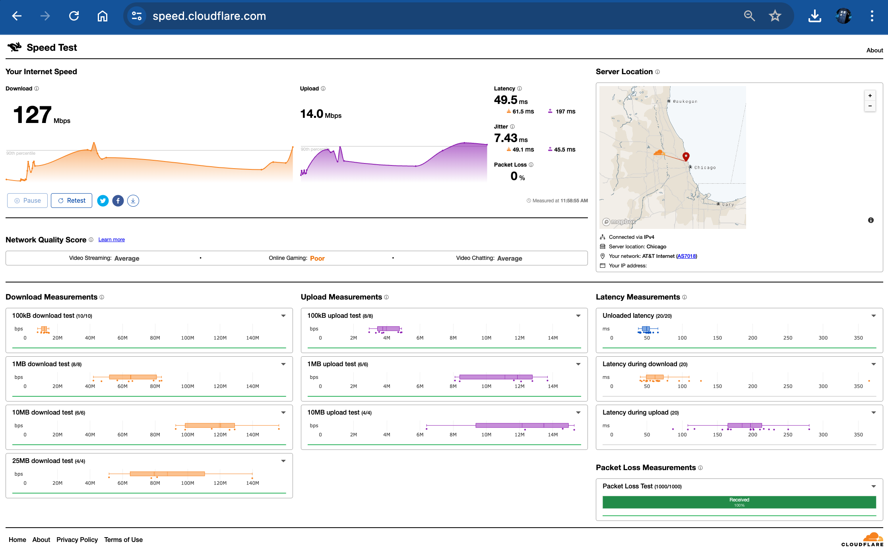

# **Cómo Usar el Speed Test de Cloudflare y Qué Datos Analizar**  

En la era digital, la velocidad de conexión a Internet es un factor crítico para la experiencia de usuario, el rendimiento de sitios web y la productividad. Cloudflare, una de las plataformas más confiables en infraestructura web, ofrece una herramienta gratuita llamada **Speed Test** que permite medir la velocidad y calidad de tu conexión.  

En este artículo, te explicaré cómo usar esta herramienta y qué métricas clave debes observar para optimizar tu conexión.  

---

## **¿Qué es el Speed Test de Cloudflare?**  

El **Cloudflare Speed Test** (disponible en [https://speed.cloudflare.com/](https://speed.cloudflare.com/)) es una herramienta en línea que mide:  
- **Velocidad de descarga (Download)**  
- **Velocidad de subida (Upload)**  
- **Latencia (Ping)**  
- **Jitter** (variación en la latencia)  
- **Pérdida de paquetes (Packet Loss)**  

A diferencia de otros speed tests, Cloudflare utiliza su propia red global de servidores para ofrecer resultados más precisos y menos influenciados por la congestión de proveedores locales.  

---

## **¿Cómo Usar el Speed Test de Cloudflare?**  

Sigue estos pasos para realizar una prueba de velocidad efectiva:  

1. **Accede al sitio oficial**:  
   - Ve a [https://speed.cloudflare.com](https://speed.cloudflare.com) desde cualquier navegador (Chrome, Firefox, Edge, etc.).  

2. **Inicia la prueba**:  
   - Haz clic en **"Start Test"** y espera unos segundos mientras se analiza tu conexión.  

3. **Analiza los resultados**:  
   - La herramienta mostrará métricas clave como velocidad de descarga, subida, latencia y más.  

4. **Compara con estándares recomendados**:  
   - Revisa si tu velocidad coincide con lo que contrataste a tu ISP.  

---

## **¿Qué Datos Podemos Observar en los Resultados?**  

### **1. Velocidad de Descarga (Download Speed)**  
- Mide cuántos **Mbps (Megabits por segundo)** puedes recibir desde Internet.  
- **Importante para**: Streaming (Netflix, YouTube), descarga de archivos, navegación web.  
- **Valores recomendados**:  
  - **HD Streaming**: 5+ Mbps  
  - **4K Streaming**: 25+ Mbps  
  - **Juegos en línea**: 15+ Mbps  

### **2. Velocidad de Subida (Upload Speed)**  
- Indica cuántos **Mbps** puedes enviar a Internet.  
- **Importante para**: Videollamadas (Zoom, Teams), subida de archivos a la nube, transmisiones en vivo.  
- **Valores recomendados**:  
  - **Videollamadas HD**: 3+ Mbps  
  - **Streaming en vivo (720p)**: 5+ Mbps  

### **3. Latencia (Ping)**  
- Tiempo (en milisegundos, **ms**) que tarda un paquete de datos en ir y volver desde tu dispositivo a un servidor.  
- **Importante para**: Juegos online, VoIP, trading financiero.  
- **Valores recomendados**:  
  - **Óptimo**: < 50 ms  
  - **Aceptable**: 50-100 ms  
  - **Problemático**: > 150 ms  

### **4. Jitter**  
- Variabilidad en la latencia. Un **jitter alto** causa cortes en llamadas y lag en juegos.  
- **Valores recomendados**:  
  - **Ideal**: < 10 ms  
  - **Aceptable**: 10-30 ms  
  - **Problemático**: > 50 ms  

### **5. Pérdida de Paquetes (Packet Loss)**  
- Porcentaje de paquetes de datos que no llegan a su destino.  
- **Causas**: Congestión de red, problemas en el router, interferencias WiFi.  
- **Valores recomendados**:  
  - **Aceptable**: 0-1%  
  - **Problemático**: > 2% (afecta VoIP y gaming)  

---

## **¿Cómo Mejorar los Resultados del Speed Test?**  

Si tus velocidades son bajas, prueba estos consejos:  
✅ **Reinicia el router/módem**  
✅ **Usa conexión por cable Ethernet** (evita WiFi si es posible)  
✅ **Cierra aplicaciones que consuman ancho de banda** (ej. Netflix, descargas)  
✅ **Actualiza el firmware del router**  
✅ **Cambia el servidor DNS** (prueba con Cloudflare DNS: `1.1.1.1`)  

---

## **Conclusión**  

El **Speed Test de Cloudflare** es una herramienta poderosa para diagnosticar problemas de conexión. Al analizar métricas como velocidad de subida/descarga, latencia, jitter y pérdida de paquetes, puedes identificar cuellos de botella y optimizar tu Internet.  

Si los resultados son consistentemente bajos, considera contactar a tu proveedor de Internet (ISP) o mejorar tu infraestructura de red.  

¿Has probado el test de Cloudflare? ¡Cuéntanos tus resultados en los comentarios! 🚀  

🔗 **Prueba el Speed Test aquí**: [https://speed.cloudflare.com](https://speed.cloudflare.com)  

---  
**#Cloudflare #SpeedTest #InternetSpeed #Tecnología #SEO**  

*(Artículo optimizado para SEO con palabras clave relevantes como "speed test", "Cloudflare", "velocidad de Internet", "latencia", etc.)*